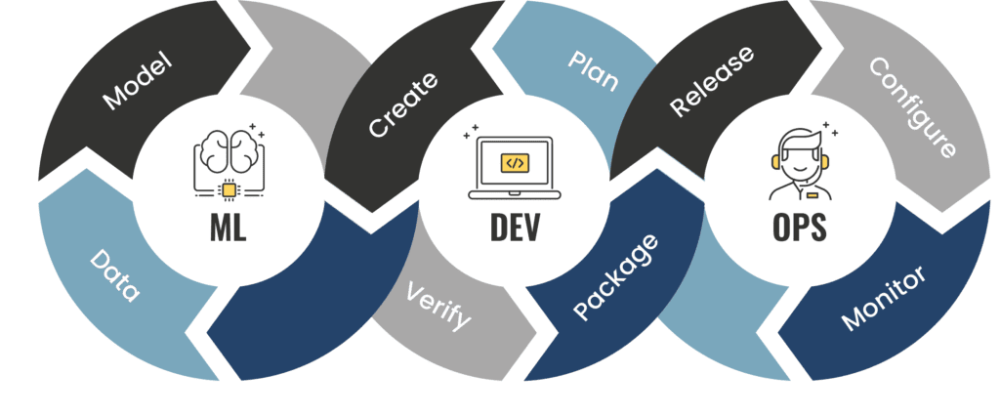
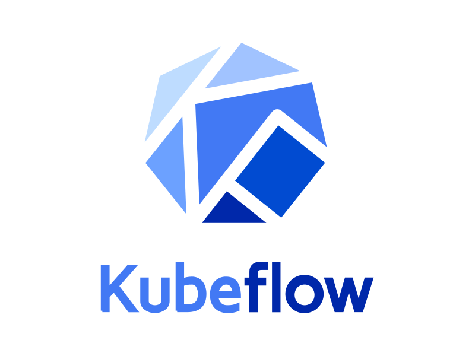

## MLOps on Google Cloud

We are to create an automated MLOps workflow following all state-of-the-art practices and technologies. What's more, get to know with gitflow and working with cloud resources.

#### Tools and technologies:

<a href="https://www.python.org/">**python**</a> &nbsp;&nbsp;&nbsp;
<a href="https://cloud.google.com/">**GCP**</a> &nbsp;&nbsp;&nbsp;
<a href="https://www.kubeflow.org//">**kubeflow**</a> &nbsp;&nbsp;&nbsp;
<a href="https://kubernetes.io/">**kubernetes**</a> &nbsp;&nbsp;&nbsp;
<a href="https://www.docker.com/">**docker**</a> &nbsp;&nbsp;&nbsp;
<a href="https://git-scm.com/">**git**</a> &nbsp;&nbsp;&nbsp;

### Branch policies

We use gitflow workflow for managing git branches. If you're not familliar with gitflow please follow [this](https://www.atlassian.com/git/tutorials/comparing-workflows/gitflow-workflow) tutorial. Additionally, all PRs are checked by a linting workflow using [flake8](https://flake8.pycqa.org/en/latest/) and [black](https://black.readthedocs.io/en/stable/).

### Workflows

Currently used workflows (github actions):
- `Lint` for code quality checking, automaticallly triggered for PRs
- `Provisioning` for environment provisioning, automatically triggered for pushes to *main* branch
