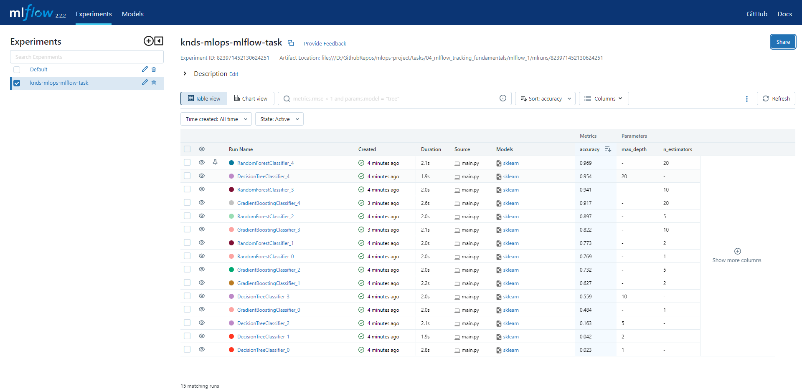
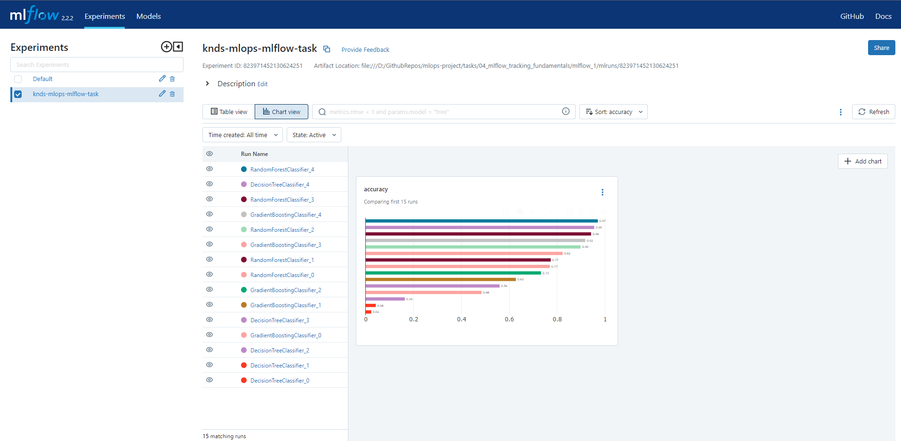

# MLflow task

## Setting up an Environment with Conda

Create a new Conda environment from the `environment.yml` file using the following command:

```bash
conda env create --file environment.yml
```

## Usage

To run tests with MLflow, run `main.py` script:

```bash
python main.py
```

To launch the MLflow tracking server, execute following 
command:

```bash
mlflow ui
```

To see MLflow UI, go to [http://localhost:5000](http://localhost:5000).

## Results

As a result of the tests, the following views were obtained in the MLflow UI


